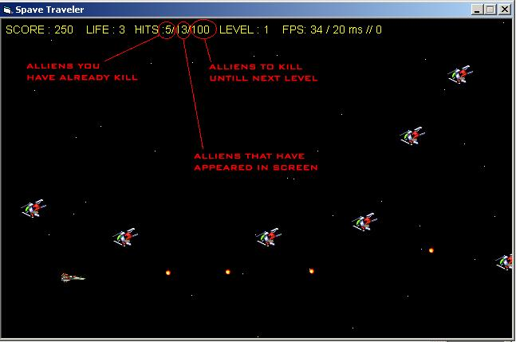



## Space Conqueror

### Description

This is a shoot 'em up game similar to projectX.

It was created with bitblt functions and all the others functions from the gdi32.dll.

It is not with full comments but i 'll do it if you ask for it. Anyway i wish you have fun with this game and vote me if you like it.

The graphics aren't mine. I found them on the internet. I didn't have time to create my own.
 
### More Info
 

             |
---                |---
**Submitted On**   |2004-07-28 23:42:38
**By**             |[Whiteulver](https://github.com/Planet-Source-Code/PSCIndex/blob/master/ByAuthor/whiteulver.md)
**Level**          |Advanced
**User Rating**    |5.0 (25 globes from 5 users)
**Compatibility**  |VB 6\.0
**Category**       |[Games](https://github.com/Planet-Source-Code/PSCIndex/blob/master/ByCategory/games__1-38.md)
**World**          |[Visual Basic](https://github.com/Planet-Source-Code/PSCIndex/blob/master/ByWorld/visual-basic.md)
**Archive File**   |[Space\_Conq177662812004\.zip](https://github.com/Planet-Source-Code/whiteulver-space-conqueror__1-55291/archive/master.zip)

